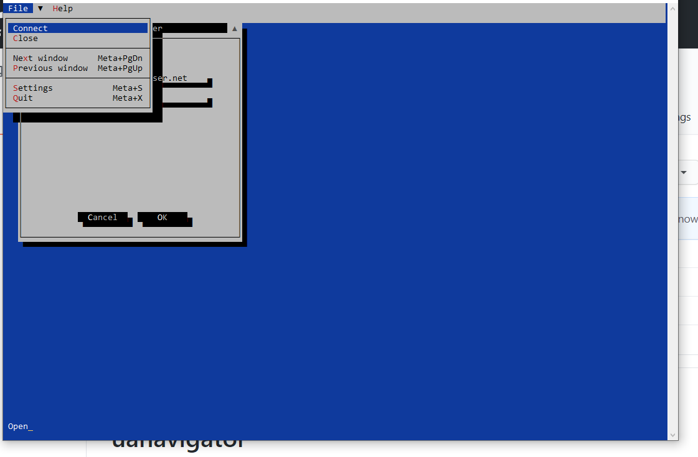

# uanavigator
OPC-Ua console program

The gui uses midnight commander alike key strokes.

Build instructions:
install finalcut library 
https://github.com/gansm/finalcut

then type make in the src directory
